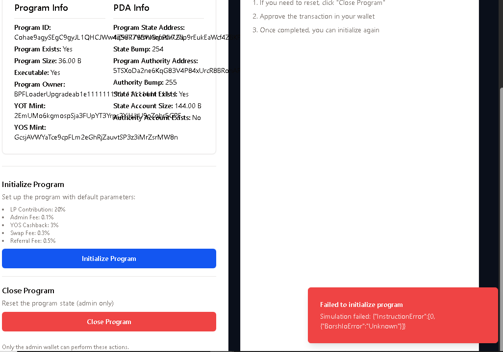

# Solving BorshIoError: Unknown in MultihubSwap

This guide explains the root cause of the persistent `BorshIoError: Unknown` issues in the MultihubSwap contract and details our solution using direct buffer processing on both ends.

## The Problem: Serialization Mismatch



The MultihubSwap V3 contract relies on Borsh for instruction deserialization in Rust, but our JavaScript client uses manual byte buffer construction. This creates a fundamental mismatch in how data is transmitted vs. how it's interpreted.

**Detailed error logs:**
```
(3) ['Program Cohae9agySEgC9gyJL1QHCJWw4q58R7Wshr3rpPJHU7L invoke [1]', 
     'Program Cohae9agySEgC9gyJL1QHCJWw4q58R7Wshr3rpPJHU7L consumed 6814 of 200000 compute units', 
     'Program Cohae9agySEgC9gyJL1QHCJWw4q58R7Wshr3rpPJHU7L...to serialize or deserialize account data: Unknown']
```

This error occurs because:
1. JavaScript client constructs a manual buffer
2. Rust program tries to deserialize with Borsh
3. The schemas don't match perfectly
4. Result: `BorshIoError: Unknown`

## Solution: Manual Parsing on Both Sides

We've created a V4 version of the contract with manual instruction data parsing:

### JavaScript (Client-Side):
Our current buffer serialization functions are well-designed:

```typescript
// For Initialize instruction
export function buildInitializeInstruction({...}): Buffer {
  const discriminator = Buffer.from([0]); // enum variant 0
  const buffer = Buffer.alloc(1 + 32*3 + 8*5);
  
  let offset = 0;
  discriminator.copy(buffer, offset);
  offset += 1;
  
  admin.toBuffer().copy(buffer, offset);
  offset += 32;
  // ... more fields with careful offset tracking
}
```

### Rust (Program-Side):
We've replaced Borsh deserialization with manual parsing:

```rust
// Process instruction function
pub fn process_instruction(
    program_id: &Pubkey,
    accounts: &[AccountInfo],
    instruction_data: &[u8],
) -> ProgramResult {
    // Parse instruction manually instead of using Borsh
    let instruction = parse_instruction_data(instruction_data)?;
    
    // ... rest of the function
}

// Manual parsing function
fn parse_instruction_data(instruction_data: &[u8]) -> Result<SwapInstruction, ProgramError> {
    // Check input isn't empty
    if instruction_data.is_empty() {
        return Err(ProgramError::InvalidInstructionData);
    }
    
    // Read first byte as discriminator
    let discriminator = instruction_data[0];
    
    match discriminator {
        // Initialize (discriminator 0)
        0 => {
            // Verify length (1 + 32*3 + 8*5 = 137 bytes)
            if instruction_data.len() != 137 {
                msg!("Invalid Initialize data length: {}", instruction_data.len());
                return Err(ProgramError::InvalidInstructionData);
            }
            
            // Extract fields with exact same layout as JS
            let admin = Pubkey::new(&instruction_data[1..33]);
            let yot_mint = Pubkey::new(&instruction_data[33..65]);
            let yos_mint = Pubkey::new(&instruction_data[65..97]);
            
            // ... extract remaining fields
            
            Ok(SwapInstruction::Initialize { ... })
        },
        
        // Swap (discriminator 1)
        1 => { /* Similar manual parsing */ },
        
        // CloseProgram (discriminator 2)
        2 => { /* Simple check and return */ },
        
        _ => Err(ProgramError::InvalidInstructionData),
    }
}
```

## Key Changes

1. **Replaced Borsh with Manual Parsing**:
   - `let instruction = SwapInstruction::try_from_slice(instruction_data)?;` 
   - ⬇️
   - `let instruction = parse_instruction_data(instruction_data)?;`

2. **Identical Buffer Layout**:
   - Both JavaScript and Rust use the exact same byte layout
   - Same field order and byte offsets
   - Same primitive encoding (e.g., little endian)

3. **Improved Error Messages**:
   - More specific error reporting on exactly what part of parsing failed
   - Length validation to catch truncated instructions

## Deployment Steps

1. The updated Rust code is in `program/src/multihub_swap_v4.rs`
2. The program ID routing is updated in `program/src/lib.rs`
3. Use the `deploy_multihub_swap_v4.sh` script to deploy to Solana devnet

## Testing the Fix

After deployment, try to initialize the program via the MultihubSwap Admin page. The BorshIoError should be resolved because:

1. JavaScript serializes with the same buffer format
2. Rust manually reads the bytes instead of using Borsh
3. Both sides agree on the data format exactly

## Advantages of This Approach

1. **Full Control**: We completely control the byte layout on both ends
2. **Better Errors**: More specific error messages for debugging
3. **No Dependencies**: Removed reliance on Borsh for instruction parsing
4. **Future-Proof**: Buffer format can be changed without Borsh schema updates